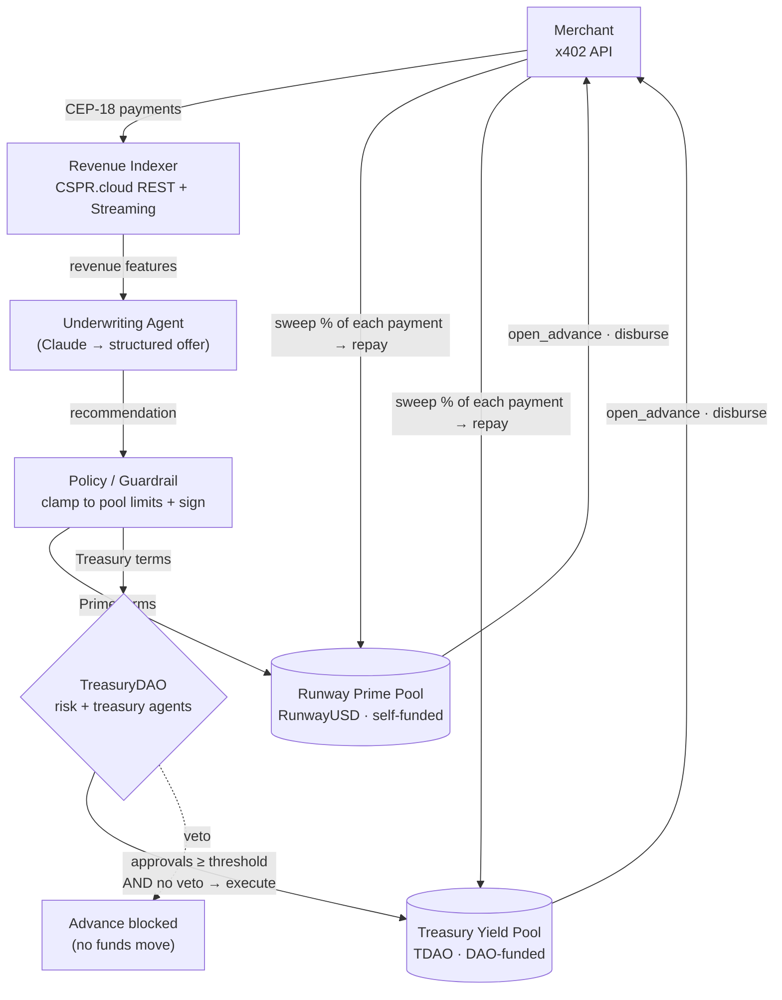
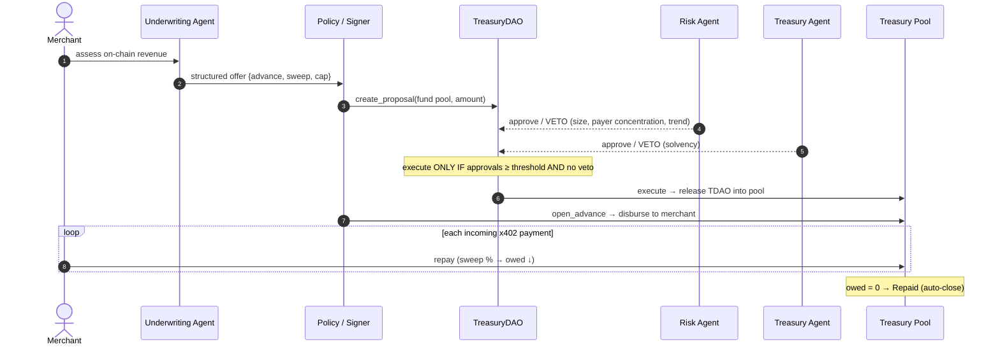
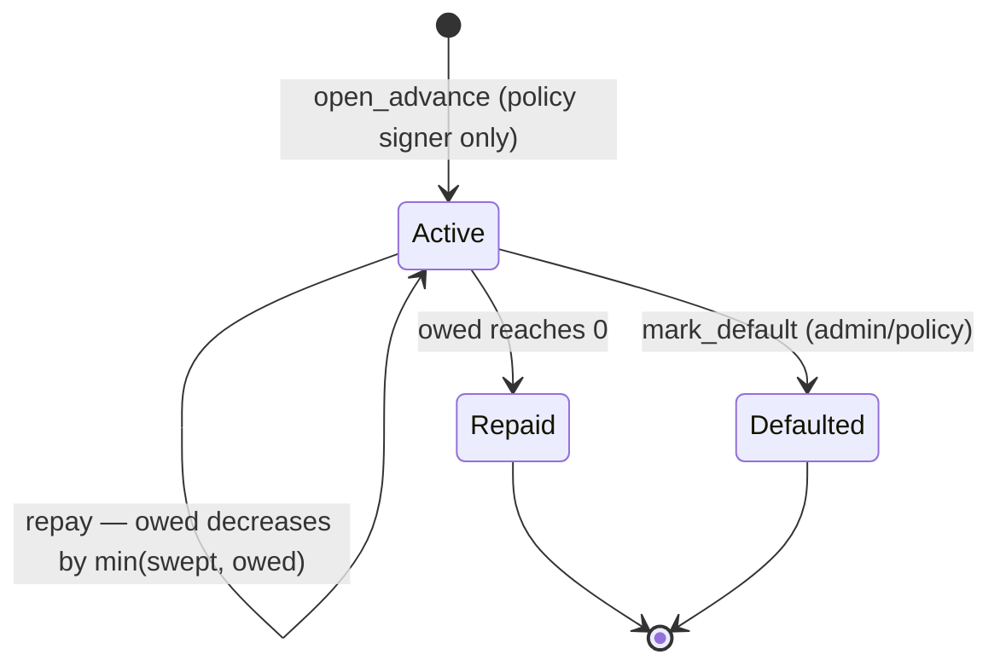

# Runway

> **Agentic revenue-based financing for the x402 economy, on Casper.**
> An AI agent reads a merchant's on-chain x402 revenue, underwrites a revenue-based
> advance, and Casper smart contracts disburse it — then auto-sweep a fixed percentage
> of every future payment to repay. The revenue *is* the collateral. And the riskier
> capital is governed by a **multi-agent DAO** that can veto an advance on-chain.

Built for the Casper Agentic Buildathon. Two novel contracts, two stacked agent layers,
a full financing lifecycle proven end-to-end on Testnet.

---

## Why this is different

The x402 economy is producing a new kind of business: services that earn a stream of
tiny, per-request, on-chain payments from autonomous agents. That revenue is real,
continuous, and cryptographically verifiable — but it isn't yet *financeable*. Runway
makes it financeable, and does it **agent-native**:

- **The agent is the underwriter**, not a chatbot bolted on. It reasons over real
  on-chain revenue (volume, trend, volatility, payer concentration) and emits a
  structured, auditable offer.
- **Two capital pools, two risk appetites.** *Runway Prime* is self-funded and
  conservative; *Treasury Yield* is higher-yield and **governed by a multi-agent DAO**.
- **Two stacked agent layers.** Runway's underwriter *proposes*; the DAO's **risk** and
  **treasury** agents *deliberate and can veto*; the contracts *enforce* the decision
  independently. An AI proposes, an AI council governs, the chain settles.
- **The revenue underwrites itself** — advance and repayment happen on-chain in the same
  asset, so the whole loop is trust-minimized.

**Core discipline:** *the agent reasons · the protocol decides · the contract enforces.*
Every rule is re-checked on-chain, so no agent can move funds outside the rails.

---

## System architecture



## The two-agent-layer flow (Treasury advance)



## Advance lifecycle (enforced by the contract)



---

## The two pools

| Pool | Asset | Funding & governance | Risk band | Target APY* |
|------|-------|----------------------|-----------|-------------|
| **Runway Prime** | RunwayUSD (CEP-18) | self-funded pool | Conservative | ~10% |
| **Treasury Yield** | TDAO (CEP-18) | funded & governed by the multi-agent TreasuryDAO | High-yield | ~23% |

The **same** agent offer is clamped to each pool's risk appetite, producing different
terms and APY. A merchant chooses a pool; an LP compares pools by risk/return.

\* Illustrative: `(midpoint cap − 1) × annual turnover × (1 − expected default)`.

### How the multi-agent DAO governs

The `TreasuryDAO` holds TDAO and releases it **only if `approvals ≥ threshold AND not
vetoed`**, enforced on-chain. Runway's underwriter posts a funding proposal; the DAO's
**risk agent** hard-vetoes on payer concentration / advance size / collapsing revenue,
and the **treasury agent** checks solvency. Demonstrated live:

- healthy, diversified merchant → **APPROVED** (both agents approve)
- payer-concentrated merchant → **VETOED** by the risk agent (no capital moves)

The same merchant Prime would fund, the DAO refuses — a second, independent credit check.

---

## Monorepo layout

| Package | What |
|---------|------|
| [`/contracts`](contracts/) | Odra 2.8 Rust→WASM — `RunwayAdvance` (balance-derived pool); consumes the `TreasuryDAO` |
| [`/indexer`](indexer/) | CSPR.cloud REST + Streaming → normalized revenue series & features |
| [`/agent`](agent/) | Underwriting agent (Claude, structured output) + multi-agent DAO **deliberation** logic |
| [`/policy`](policy/) | Deterministic guardrail + on-chain signer (`open_advance`, DAO `create_proposal`/`approve`/`veto`/`execute`) |
| [`/web`](web/) | Dashboard — **Next.js 16 + shadcn/ui** (pool picker, LP view, live deliberation trace) |
| [`/shared`](shared/) | Types shared across TS packages (mirror the contract ABI) |

## Casper toolkit usage

| Toolkit | Role in Runway |
|---------|----------------|
| **Odra 2.8** | `RunwayAdvance` pools + the multi-agent `TreasuryDAO`; CEP-18 cross-contract calls |
| **CSPR.cloud** | Revenue indexer (REST history + Streaming live payments); on-chain verification |
| **casper-js-sdk** | Sign + submit every entry-point call (advance + DAO governance) from the policy layer |
| **x402 (Casper)** | The revenue rail being financed — merchant CEP-18 payments are the collateral stream |

---

## Live on Casper Testnet (`casper-test`)

**Contracts & pools**

| Artifact | Hash |
|----------|------|
| RunwayUSD token (CEP-18) | `hash-c1e2015007e75f92b970fb4b877da153d5ecb365e7a5f401492290cc06f99cd8` |
| **Runway Prime** pool | `hash-003f011a793cf21a859aae15cfff7f298b91dcbac57f33b5f9b7177eca7eac65` |
| **Treasury Yield** pool | `hash-5004c89791aeacc3e8c43175058638b7a4c4fc5f7c1543c524a6bc2b84d433a1` |
| **TreasuryDAO** (multi-agent governance) | `hash-af05d310be13a0797a0baae39d9b9bd663d013815b472f46b9f3e0fe2fc9a4d1` |

**One full agent-governed advance, end to end on-chain** (50 TDAO: treasury → pool →
merchant, then swept back as principal + spread until `owed` = 0):

| # | Step | Tx |
|---|------|----|
| 1 | `create_proposal` (execution agent) | `5fb00f0b3448b3e054986e693230806293c09cd7a82652eb7a0e3e3a4f21d852` |
| 2 | `approve` (treasury agent) | `048892e9842cfb693fd4719c865e6b0506e4a22b000aae0a93b614c276608745` |
| 3 | `approve` (risk agent) | `73c36152e14a7838d8f66535831f8d4527d5eaa0133b88eca8978756aa69388b` |
| 4 | `execute` → release TDAO to pool | `a809afb1b7ffded1ff72a9861549157ec1f315b1dd9f6aa0f454955e6f9d877b` |
| 5 | `open_advance` → disburse to merchant | `9105bbac46044478bf8a161430e2f70fc2a202e856a6028eec8d87e6d283e0e5` |
| 6 | `repay` sweep #1 | `67b736ef14ea2c2c8e683844b2d02d2340fbb347bf4f5a8e5fb296af5f3f5809` |
| 7 | `repay` sweep #2 → `owed`=0 → **Repaid** | `b1deced00adcfbd2e1442d20ab3fdba80bc6a25daf184a48d66f413349b56495` |

Explore any hash at `https://testnet.cspr.live/transaction/<hash>`.

---

## Getting started

**Prerequisites:** Node ≥ 20, pnpm 9, Rust stable + `wasm32-unknown-unknown`,
`cargo-odra` 0.1.7.

```bash
pnpm install
cp .env.example .env          # CSPR.cloud key, RPC, contract hashes, policy signer PEM, LLM key
pnpm dev:web                  # dashboard → http://localhost:3000
```

The dashboard runs the real pipeline: **Assess** (indexer → agent → policy) → compare
pools → **Accept** (signs `open_advance`; for Treasury Yield, runs the DAO deliberation).
With `ANTHROPIC_API_KEY` set it uses the hosted model; otherwise a deterministic fallback.

### Contracts

```bash
cd contracts/runway_advance
cargo odra test                                   # native tests
cargo odra build                                  # → wasm/RunwayAdvance.wasm

# deploy a pool to Testnet (Odra livenet backend)
POOL_ASSET=hash-<cep18-package> ODRA_CASPER_LIVENET_ENV=casper-test \
  cargo run --bin deploy_pool --features livenet --release
```

## Verify

```bash
pnpm -r typecheck                                 # all packages
(cd policy && pnpm test) && (cd agent && pnpm test) && (cd indexer && pnpm test)
(cd contracts/runway_advance && cargo odra test)
```

Coverage: policy clamping (over-advance / sweep / cap limits), revenue feature
derivation, agent fallback, **multi-agent deliberation** (approve/veto/quorum), and the
contract's enforcement guarantees (policy-signer-only open, immutable owed/sweep,
overpayment clamp, pool solvency).
